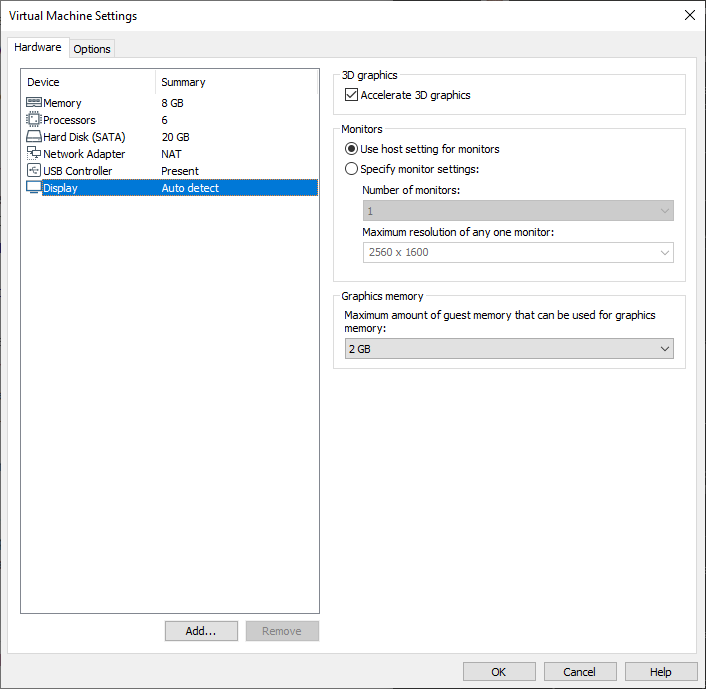
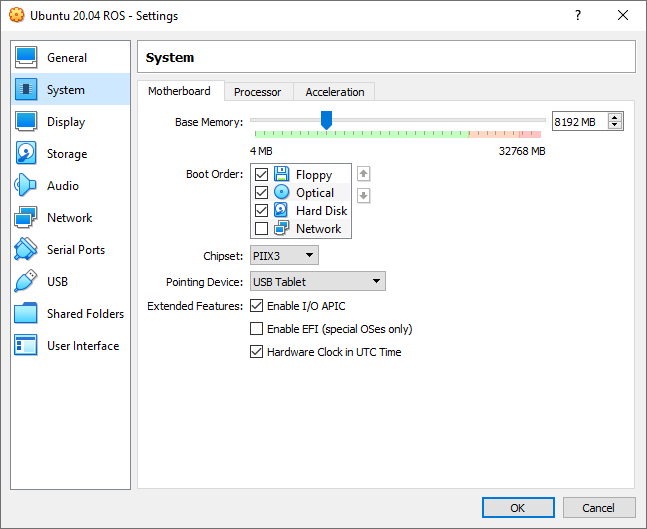
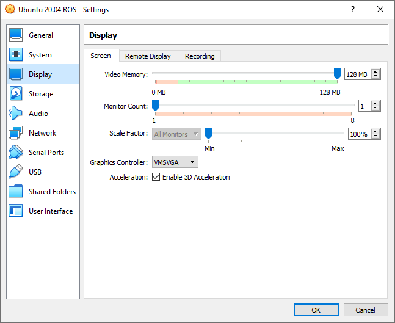

# AIHUB Required Environment Setup

During the workshop, we are going to use virtual machine image that have the required tools. You can either use VMWare Workstation Player or VirtualBox for this purpose. 

In our experiments, we saw that VMWare's performance was superior to VirtualBox as the workshop requires some simulation running.

To be able to run this image, your computer should have 20 GB of free space!

## Using VMWare Workstation Player

Simply click 

Player -> File -> Open

And select the image file. After image is selected and the storage path is set, you can click Import.

If you receive this sort of an error, you can just click Retry and it will ease up some of the settings. 

After importing, if you right click the "Ubuntu 20.04 ROS_aihub_ws" and settings, you can change the some performance related settings suitable for your computer.

If your computer has a GPU, you can change the settings as its below. 

## Using VirtualBox

Simply click,

File -> Import Appliance..

Then follow the steps with default settings. The import process should take ~2-5min depending on your computer performance.

Below, you can see the settings that we are using. You can tweak them considering your computer performance.

