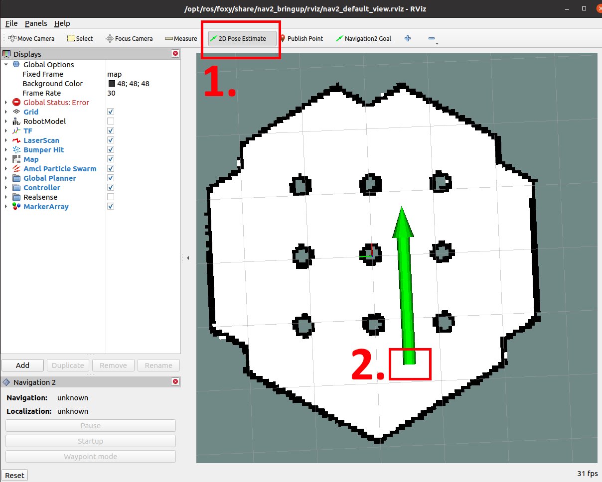
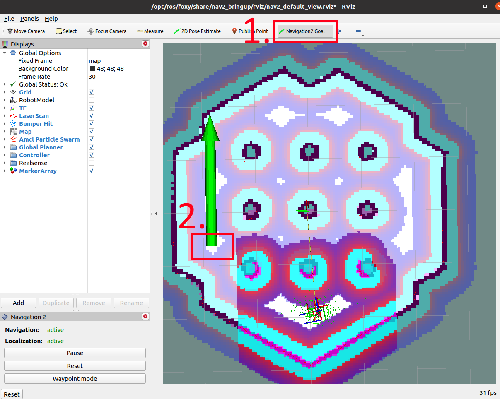

# AIHub Tampere Workshop
In this workshop, you will get to know the basics of ROS2 and Simulation Environment Gazebo.

For the Troubleshooting section, see the end of this document.

For virtual machine instructions, see [installation guide](./INSTALLATION.md)

The password of virtual machine is 

```
ros
```

if you need to run any sudo commands.

## Hands-on Gazebo Turtlebot Simulations
In ROS2, you will need to source the required workspaces. The given virtual machine will already have Ubuntu 20.04, ROS2 Foxy, Navigation2 stack installed. 
## Step 1 - Source: 
To activate those, whenever you open a new terminal, you need to write this commands;
```sh
source /opt/ros/foxy/setup.bash
source ~/turtlebot3_ws/install/setup.bash

```
If you are always using the same workspaces and you don't need to change anything, you can always add those two lines into the end of ~/.bashrc file. This way, each new terminal will already process those commands. But don't forget that the order of workspaces are crucial. If there are two packages in both workspaces, the package from last sourced workspace. 
## Step 2 - Launch Nodes
The Navigation2 Stack has a package called 'nav2_bringup'. In this package, there are launch files to either run a simulation, or run it on a real machine or another robot. This launch files and parameters are also a reference that you can use in your applications to create custom launch files for your needs. 

To run the simulation environment Gazebo, run following commands after sourcing.
```sh
ros2 launch nav2_bringup tb3_simulation_launch.py

```

_Tip: ROS2 has an autocomplete feature. After you enter some letters, you can use tab or double tab to complete the command._

## Step 3 - Give a 2D Pose Estimate
After Gazebo and RVIZ are initialized, you need to give an 2D Pose Estimate of the robot. This is required because in the beginning, the SLAM algorithm does not actually know where to look. By giving the 2D Estimate Pose, the SLAM algorithm, in this case just matching so ACML, matches the laser scan with the existing map file. Afterwards, you can see the location of the Robot on RVIZ, and continue giving Navigation2 Goal.

Click 2D Pose Estimate (1.), and click and drag at the 2. area to have a similar green arrow. You do not need to be exactly specific for this step, just a coarse estimation is enough. Even if the localization is bad at the start, by the time that robot is moving around, you can see that the localization gets better.



For this environment, the spawn position of Turtlebot is defined to be at that corner. If you are not sure about the location, you can check the Gazebo window and you will see the robot's position and pose visually. 

## Step 4 - Give a Navigation2 Goal
By using the toolbox of RVIZ, you can give a command to Navigation2 Stack. This command invokes the behavior tree, takes the goal pose, sends it to planner server. After path is calculated by taking obstacles in account, controller server is invoked and starts following that route. In the slides, you can find visual information about it.

Click Navigation2 Goal (1.) and click and drag at a desired location within the map. You will see that the Navigation2 stack processes that goal, creates a path to goal and starts following. Meantime, in the command line, you can see the logs of Navigation2 stack, how the controller servers and navigators are processing.




# Extras

## Changing configuration of Navigation2
You can clone this repository into a new workspace and have the ability to change the configuration of Navigation2 Simulation. This repository contains nav2_bringup package, which can be used to run simulation.

Run the following commands in the home directory. This will create a new workspace folder and src subdirectory, then clone this repository.
```sh
mkdir -p my_ws/src
cd my_ws/src
git clone https://github.com/mehmetkillioglu/aihub_tampere_nov.git

```

After cloning, in the my_ws directory, run the following command to build.
```sh
cd ~/my_ws
colcon build --symlink-install

```
_We use --symlink_install tag during build operation. This way, the files in the share folder, which is under install, will contain symbolic links instead of the file itself. This way, when you update a parameter file, for instance ~/my_ws/src/aihub_tampere_nov/nav2_bringup/bringup/params/nav2_params.yaml, will be used instead of a copy under install directory. If you modify the file under install, it will be overwritten when another build command is called._

After each build command, do not forget to source the workspace.
```sh
source ~/my_ws/install/setup.bash

```

Now that we have the same package names as the original nav2_bringup, this workspace will be the active one. Meaning that the launch command will use this codes and parameters. You can launch the simulation again with the same command.

```sh
ros2 launch nav2_bringup tb3_simulation_launch.py

```

To verify that you are using this workspace for launch, you can configure parameters.

```sh
cd ~/my_ws/src/aihub_tampere_nov/nav2_bringup/bringup/params
gedit nav2_params.yaml

```

When the text editor is open, you can see all the parameters that Navigation2 modules and servers are using. For more detailed explanation, please refer to [Navigation2 Configuration Guide](https://navigation.ros.org/configuration/index.html).

One of the simple parameter that you can change and observe the output is the goal checker parameters. This xy_goal_tolerance and yaw_goal_tolerance is basically controller server's condition to determine if the goal has been reached. If you increase those values, the robot will stop once the condition is satisfied. Lower values will end up being more precise at the goal.

```
controller_server:
  ros__parameters:
    ...
    goal_checker:
      ...
      xy_goal_tolerance: 0.25
      yaw_goal_tolerance: 0.25
      ...
      
```

But keep in mind that some parameters might effect other functionalities, for instance FollowPath xy_goal_tolerance values which is used by RotateToGoal. So before making changes, make sure to follow configuration guide released by Navigation2.  

## Visualization Tools

The ROS2 Foxy version has a graphical interface which enables users to plot various topics, visualize nodes and relations.

# Troubleshooting

## Gazebo just closes before loading the screen
It might be related to the Virtual Machine GPU management. if you write the following command before calling ros2 launch command, it might resolve this issue.
```sh
export SVGA_VGPU10=0
```

Also check the if the settings are as followed; 


You can disable "Accelerate 3D Graphics" if your computer does not have a compatible GPU. 

## You get this screen when importing the virtual machine to VMWare
Just click "Retry". VMWare will then optimize settings and the import should succeed then.

